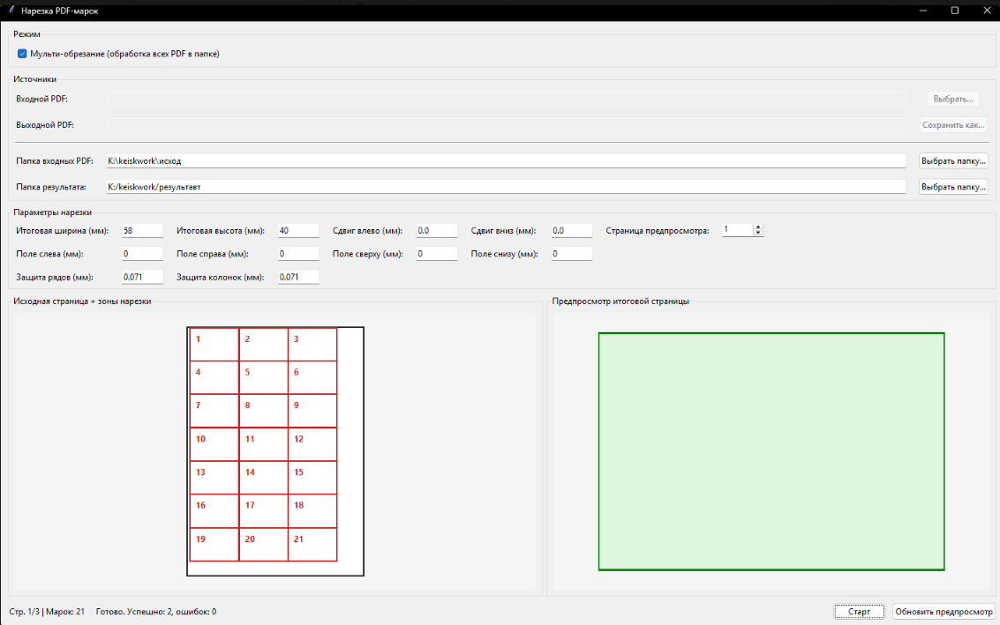
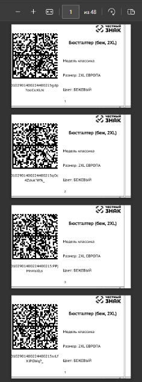

# Нарезка PDF‑марок (Desktop Utility)

> [!IMPORTANT]
> **Публикация:** в открытом доступе только описание и скриншоты. **Исходный код не публикуется** (коммерческий заказ).

## 🎯 Кратко

Настольная утилита, которая пакетно обрабатывает PDF из выбранной папки и формирует новые PDF с теми же именами, где марки выстроены вертикально, размер каждой марки — **58×40 мм**.

## 🧩 Описание

Проект выполнен под задачу заказчика: автоматически читать все PDF в каталоге источника и сохранять результат в каталог назначения без ручной разметки по каждому файлу.  
Поддержаны оба согласованных шаблона входных файлов: с разделительными линиями и без линий между этикетками.  
На выходе для каждого входного документа создается PDF с тем же названием и целевой вертикальной компоновкой марок.

## ✅ Что реализовано

- пакетная обработка всех PDF из выбранной папки;
- сохранение в папку результата с исходными именами файлов;
- фиксированный размер марки **58×40 мм**;
- вертикальная раскладка марок «одна под другой»;
- поддержка двух рабочих шаблонов исходников (с линиями и без линий);
- интерфейс с предпросмотром зоны нарезки и итоговой страницы.

## 🧰 Технологии

| Категория | Стек |
|-----------|------|
| Платформа | Desktop (Windows) |
| Язык | Python |
| UI | PySide6 / Qt |
| Работа с PDF | PyMuPDF (fitz), pypdf |
| Сборка | PyInstaller |

## 🖼️ Материалы

## Исходный код

> [!NOTE]
> В публичный доступ не передается. По согласованию возможен ограниченный разбор архитектуры и логики обработки.

## Лицензия

> [!CAUTION]
> Описание и медиа — для портфолио. Коммерческая реализация передана заказчику.
